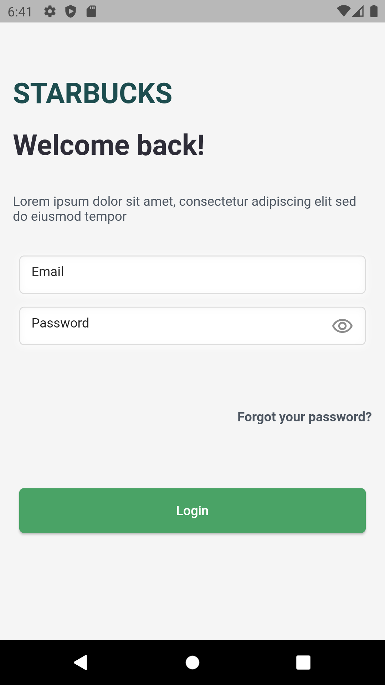
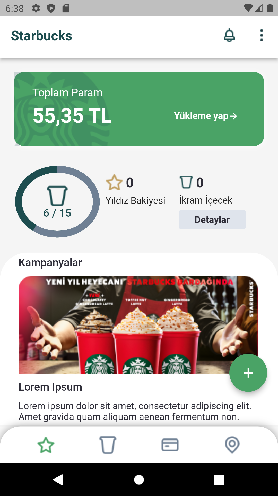
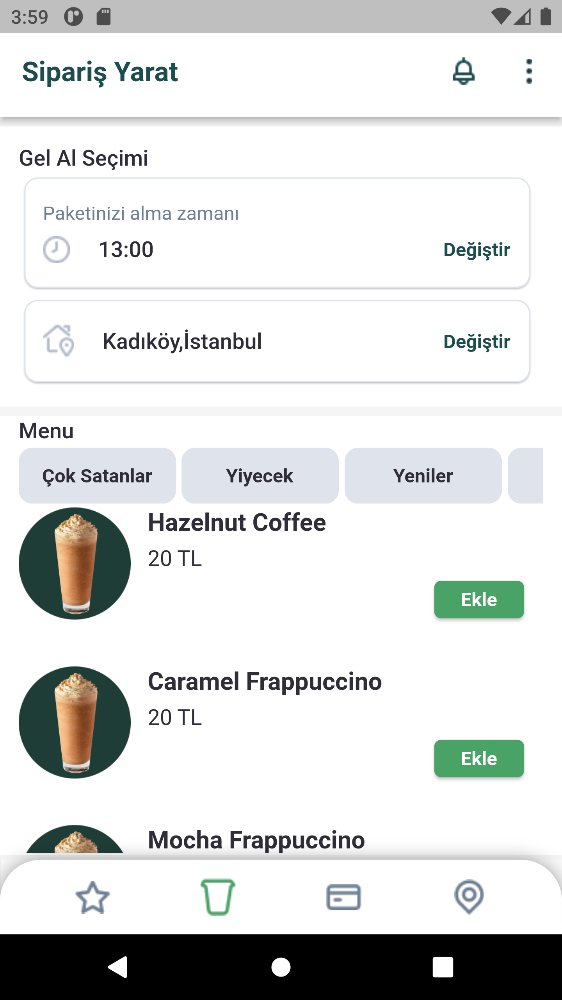
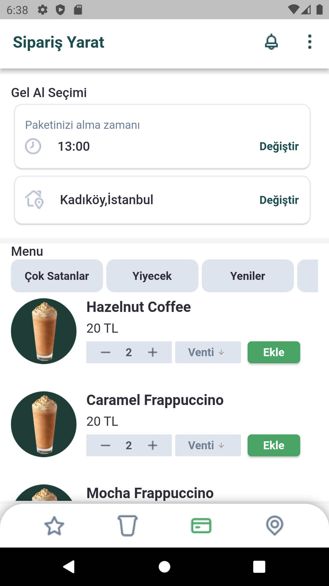
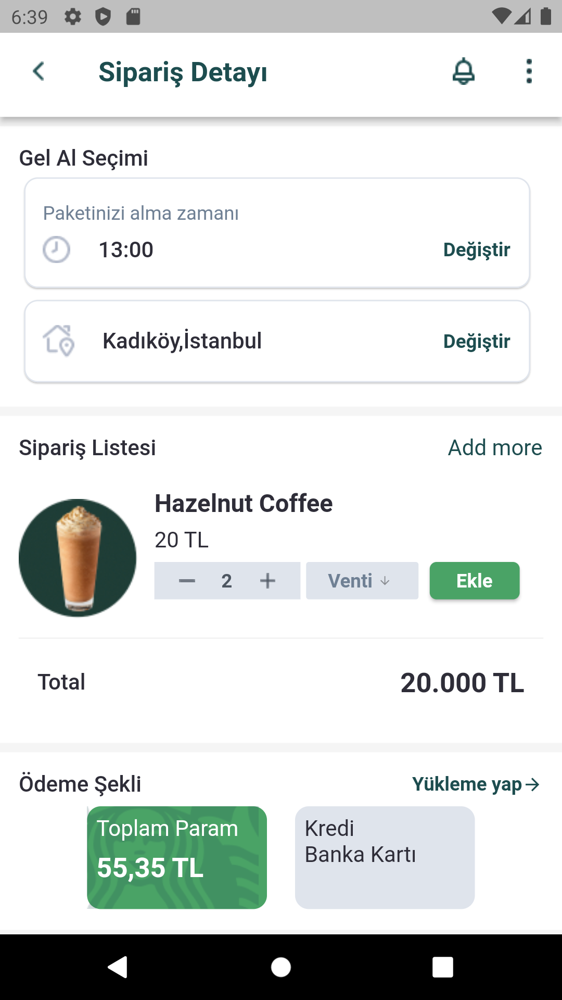
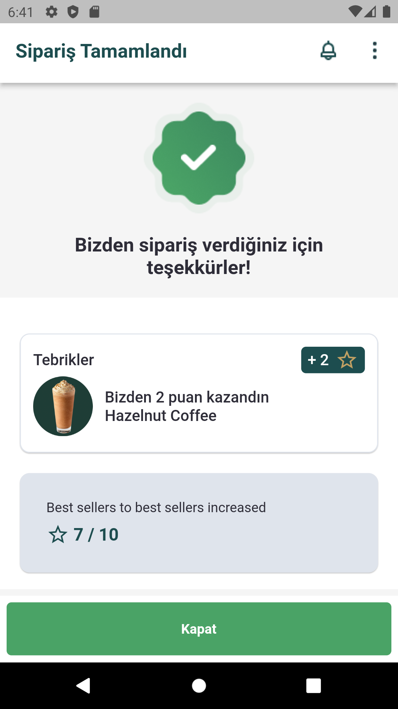

# Starbucks UI 

In this project, Starbucks UI was created using atomic widgets along with clean code.You can access the application's atomic widgets under the product/widget folder.
In addition, the Kartal package was used to create a responsive design in the project.

## Project Run

Clone this Project

  ```bash
  git clone https://github.com/gamzegurcan/Flutter-Starbucks-App-UI.git
  
  ```
  

Go to base
 ```bash

  cd my-project

 ```
 
Get Project Packages
```bash
  flutter pub get

```
Project Run
```bash
  flutter run
```
## Project ScreenShots

<table>
  <tr>
    <td>Login Page</td>
    <td>Home Page</td>
    <td>Order Page</td>  
  </tr>
  <tr>
    <td></td>
    <td></td>
    <td></td>
  </tr>  
</table>
<table>
  <tr>
    <td>Order Select Page</td>
    <td>Order Detail Page</td>
    <td>Menu Detail</td>  
  </tr>
  <tr>
    <td></td>
    <td></td>
    <td></td>
  </tr>  

</table>
<table>
  <tr>
    <td>Order Completed Page</td> 
  </tr>
  <tr>
    <td></td>
  </tr>  
</table>
